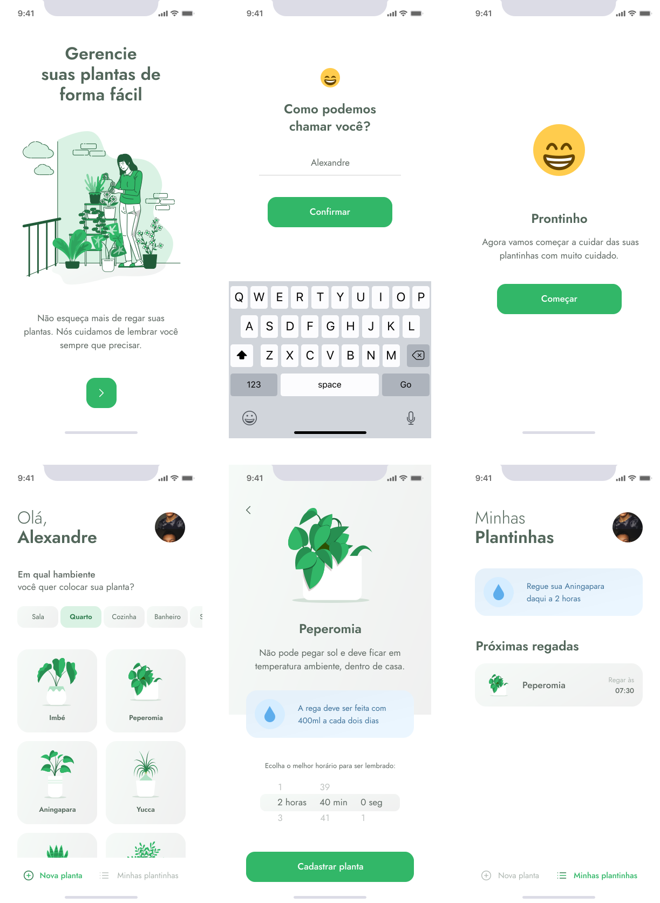

<h1 align="center">
  
</h1>

<h3 align="center">
  PlantManager, Mobile
</h3>

<blockquote align="center">“Mude você e todo o resto mudará naturalmente”!</blockquote>

  <a href="#-tecnologias">Tecnologias</a>&nbsp;&nbsp;&nbsp;|&nbsp;&nbsp;&nbsp;
  <a href="#-projeto">Projeto</a>&nbsp;&nbsp;&nbsp;|&nbsp;&nbsp;&nbsp;
  <a href="#-instalação-e-execução">Instalação e execução</a>&nbsp;&nbsp;&nbsp;|&nbsp;&nbsp;&nbsp;
  <a href="#-licença">Licença</a>

 

  

## 🚀 Tecnologias

Esse projeto foi desenvolvido com as seguintes tecnologias:

- [React Native](https://reactnative.dev/)
- [Expo](https://expo.io/)
- [TypeScript](https://www.typescriptlang.org/)

## 💻 Projeto

PlantManager é uma aplicação criada em React Native na 5ª edição do bootcamp da Rocketseat, Next Level Week, com o instrutor Rodrigo Gonçalves e tem como objetivo ajudar a cuidar melhor da nossas plantinhas em casa.

Possibilita gerenciar as plantas por ambiente (sala, qauarto)... Ver todas as informações sobre a planta e por fim cadastrar uma notificação de alerta com o horário para irrigarmos a planta.

## 📥 Instalação e execução

Faça um clone desse repositório

### Mobile

1. A partir da raiz do projeto, entre na pasta rodando `cd mobile`;
2. Execulte `npm install` ou `yarn` para instalar as dependências;
3. Execute `expo start` para emular o projeto.

## 👨‍💻 Desenvolvido

Armando Arlan Joergensen 

## 📝 Licença

Esse projeto está sob a licença MIT. Veja o arquivo [LICENSE](LICENSE.md) para mais detalhes.
